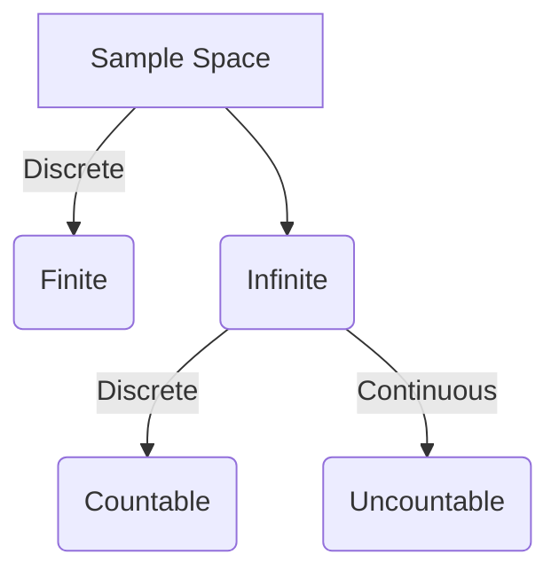

{}

This section will introduce you to basic terminologies and definitions used in probability for AI & ML.<br>
[Probability Videos Playlist](https://youtube.com/playlist?list=PLnpa6KP2ZQxcI3JyTIwOTKXY7ANhw__v1&si=MNoo5fxBo_10dLuM)

{}



Why do we need to understand what is **Probability** ?


 
Because the world around us is very uncertain, and **Probability** acts as - <br> the *fundamental language* 
to *understand*, *express* and *deal* with this *uncertainty*. 


For example:<br>
1. Toss a fair coin, \(P(H) = P(T) = 1/2\) <br>
2. Roll a die, \(P(1) = P(2) = P(3) = P(4) = P(5) = P(6) = 1/6\) <br>
3. Email classifier, \(P(spam) = 0.95 ,~ P(not ~ spam) = 0.05\) <br><br>

 
**Probability:**<br> Numerical measure of chance or likelihood that an event will occur. 

Range: \([0,1]\) <br>
\(P=0\): Highly unlikely <br>
\(P=1\): Almost certain <br> <br>

 
**Sample Space:**<br> Set of all possible outcomes of an experiment. <br>
Symbol: \(\Omega\)

For example:<br>
1. Toss a fair coin, sample space: \(\Omega = \{H,T\}\) <br>
2. Roll a die, sample space: \(\Omega = \{1,2,3,4,5,6\}\) <br>
3. Choose a real number \(x\) from the interval \([2,3]\), sample space: \(\Omega = [2,3]\); sample size = \(\infin\)<br>
*Note: There can be infinitely many points between 2 and 3, e.g: 2.21, 2.211, 2.2111, 2.21111, ...*
4. Randomly put a point in a rectangular region; sample size = \(\infin\)<br>
*Note: There can be infinitely many points in any rectangular region.* <br><br>

 
**Event:**<br> An outcome of an experiment. A subset of all possible outcomes. <br>
A,B,...⊆Ω

For example:<br>
1. Toss a fair coin, set of possible outcomes: \(\{H,T\}\) <br>
2. Roll a die, set of possible outcomes: \(\{1,2,3,4,5,6\}\) <br>
3. Roll a die, event \(A = \{1,2\} => P(A) = 2/6 = 1/3\) 
4. Email classifier, set of possible outcomes: \(\{spam,not ~spam\}\).<br><br>


 
**Discrete:**<br> Number of potential outcomes from an experiment is countable, distinct, or can be listed in a sequence,
even if infinite i.e countably infinite.

For example:<br>
1. Toss a fair coin, possible outcomes: \(\Omega = \{H,T\}\) <br>
2. Roll a die, possible outcomes: \(\Omega = \{1,2,3,4,5,6\}\) <br>
3. Choose a real number \(x\) from the interval \([2,3]\) *with decimal precision*, sample space: \(\Omega = [2,3]\).<br>
*Note: There are 99 real numbers between 2 and 3 with 2 decimal precision i.e from 2.01 to 2.99.* 
4. Number of cars passing a specific traffic signal in 1 hour.
<br><br>

 
**Continuous:**<br> Potential outcomes from an experiment can take any value within a given range or interval,
representing an uncountably infinite set of possibilities.

For example:<br>
1. A line segment between 2 and 3 - forms a continuum.
2. Randomly put a point in a rectangular region. <br><br>


<br>

 
**Mutually Exclusive (Disjoint) Events:**<br> Two or more events that cannot happen at the same time. 
<br>No overlapping or common outcomes. <br>If one event occurs, then the other event does NOT occur.


For example:<br>
1. Roll a die, sample space: \(\Omega = \{1,2,3,4,5,6\}\) <br> Odd outcome = \(A = \{1,3,5\}\) <br> 
    Even outcome = \(B = \{2,4,6\}\) are mutually exclusive.<br>
    \(P(A \cap B) = 0\) <br> <br>


``` 
End of Introduction 
```

