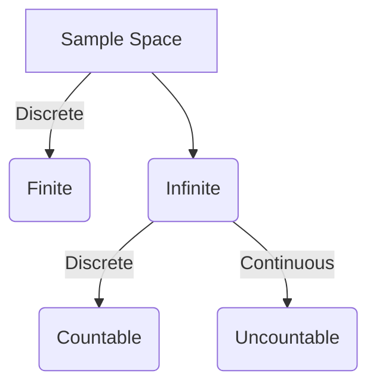


<br>


Why do we need to understand what is **Probability**?


 
Because the world around us is very uncertain, and **Probability** acts as - <br> the *fundamental language* 
to *understand*, *express* and *deal* with this *uncertainty*. 


For example:
1. Toss a fair coin, \(P(H) = P(T) = 1/2\) <br>
2. Roll a die, \(P(1) = P(2) = P(3) = P(4) = P(5) = P(6) = 1/6\) <br>
3. Email classifier, \(P(spam) = 0.95 ,~ P(not ~ spam) = 0.05\) <br><br>


Numerical measure of chance or likelihood that an event will occur. 


Range: \([0,1]\) <br>
\(P=0\): Highly unlikely <br>
\(P=1\): Almost certain <br> <br>




Set of all possible outcomes of an experiment. <br>
Symbol: \(\Omega\)


For example:
1. Toss a fair coin, sample space: \(\Omega = \{H,T\}\) <br>
2. Roll a die, sample space: \(\Omega = \{1,2,3,4,5,6\}\) <br>
3. Choose a real number \(x\) from the interval \([2,3]\), sample space: \(\Omega = [2,3]\); sample size = \(\infin\)<br>
*Note: There can be infinitely many points between 2 and 3, e.g: 2.21, 2.211, 2.2111, 2.21111, ...*
4. Randomly put a point in a rectangular region; sample size = \(\infin\)<br>
*Note: There can be infinitely many points in any rectangular region.* <br>

\(P(\Omega) = 1\) <br><br>


An outcome of an experiment. A subset of all possible outcomes. <br>
A,B,...⊆Ω


For example:
1. Toss a fair coin, set of possible outcomes: \(\{H,T\}\) <br>
2. Roll a die, set of possible outcomes: \(\{1,2,3,4,5,6\}\) <br>
3. Roll a die, event \(A = \{1,2\} => P(A) = 2/6 = 1/3\) 
4. Email classifier, set of possible outcomes: \(\{spam,not ~spam\}\).<br><br>


Number of potential outcomes from an experiment is countable, distinct, or can be listed in a sequence,
even if infinite i.e countably infinite.


For example:
1. Toss a fair coin, possible outcomes: \(\Omega = \{H,T\}\) <br>
2. Roll a die, possible outcomes: \(\Omega = \{1,2,3,4,5,6\}\) <br>
3. Choose a real number \(x\) from the interval \([2,3]\) *with decimal precision*, sample space: \(\Omega = [2,3]\).<br>
*Note: There are 99 real numbers between 2 and 3 with 2 decimal precision i.e from 2.01 to 2.99.* 
4. Number of cars passing a specific traffic signal in 1 hour.
<br><br>


Potential outcomes from an experiment can take any value within a given range or interval,
representing an uncountably infinite set of possibilities.

For example:
1. A line segment between 2 and 3 - forms a continuum.
2. Randomly put a point in a rectangular region. <br><br>






Two or more events that cannot happen at the same time. 
<br>No overlapping or common outcomes. <br>If one event occurs, then the other event does NOT occur.


For example:
1. Roll a die, sample space: \(\Omega = \{1,2,3,4,5,6\}\) <br> Odd outcome = \(A = \{1,3,5\}\) <br> 
    Even outcome = \(B = \{2,4,6\}\) are mutually exclusive.<br><br>
    \(P(A \cap B) = 0\) <br>
    Since, \(P(A \cup B) = P(A) + P(B) - (P(A \cap B)\) <br>
    Therefore, \(P(A \cup B) = P(A) + P(B)\) <br>
    

*Note: If we know that event \(A\) has occurred, then we can say for sure that the event \(B\) did NOT occur.* <br><br>


Two events are independent if the occurrence of one event does NOT impact 
the outcome of the other event.


For example:<br>
1. Roll a die twice , sample space: \(\Omega = \{1,2,3,4,5,6\}\) <br>
    Odd number in 1st throw = \(A = \{1,3,5\}\) <br> 
    Odd number in 2nd throw = \(B = \{1,3,5\}\) <br>
    *Note: A and B are independent because whether we get an odd number in 1st roll has NO impact of getting
    an odd number in second roll.* <br><br>
    \(P(A \cap B) = P(A)*P(B)\) <br> 

*Note: If we know that event \(A\) has occurred, then that gives us NO new information about the event \(B\).* <br><br>




Does \(P=0\) mean that the event is *impossible* or *improbable* ?


 
No, it means that the event is *highly unlikely* to occur. 


*Let's understand this answer with an example.*


What is the probability of choosing a real number, say 2.5, from the interval \([2,3]\) ?


 
Probability of choosing exactly one point on the number line or a real number, say 2.5, <br>
from the interval \([2,3]\) is almost = 0, because there are infinitely many points between 2 and 3.<br><br>
Also, we can NOT say that choosing exactly 2.5 is impossible, because it exists there on the number line.<br>
But, for all practical purposes, \(P(2.5) = 0\). <br><br>

*Therefore, we say that \(P=0\) means "Highly Unlikely" and NOT "Impossible".*<br><br>

Extending this line of reasoning, we can say that probability of NOT choosing 2.5, \(P(!2.5) = 1\). <br>
Theoretically yes, because there are infinitely many points between 2 and 3. <br>
But, we cannot say for sure that we cannot choose 2.5 exactly.<br>
There is some probability of choosing 2.5, but it is very small. <br><br>

*Therefore, we say that \(P=1\) means "Almost Sure" and NOT "Certain".*


 
Now, lets also see another example where \(P=0\) means *Impossible* and \(P=1\) means *Certain*.



What is the probability of getting a **7** when we roll a **6** faced die ?


 
Here, in this case we can say that \(P(7)=0\) and that means *Impossible*.<br>

Similarly, we can say that \(P(get ~any ~number ~between ~1 ~and ~6)=1\) and \(P=1 => \) *Certain*. <br>



<br>

```End of Introduction```

<!-- nav-panel:start -->
<div style="display:flex;justify-content:space-between;align-items:center;width:100%;gap:16px;">
<span><a href="">Previous: Deployment Patterns</a></span>
<span style="margin-left:auto;"><a href="">Next: Conditional Probability</a></span>
</div>
<!-- nav-panel:end -->
